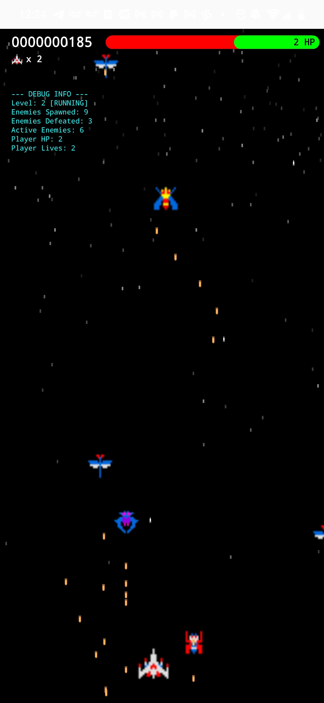
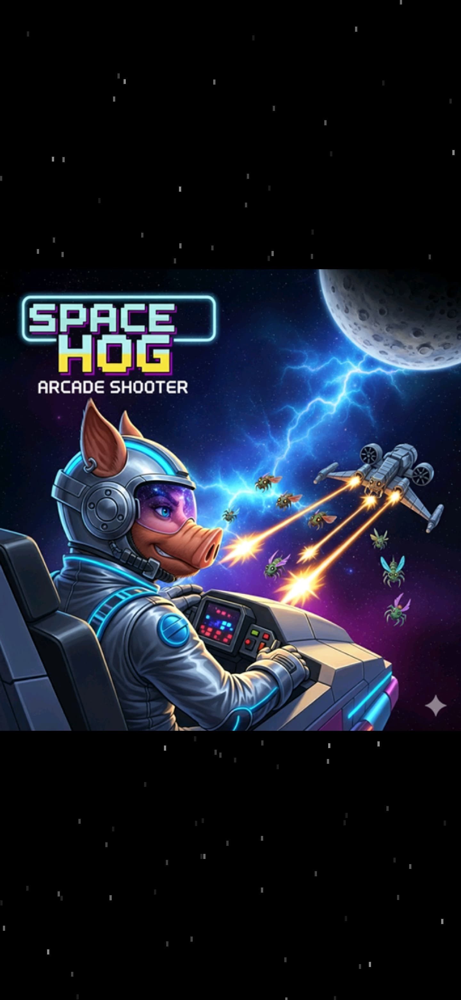
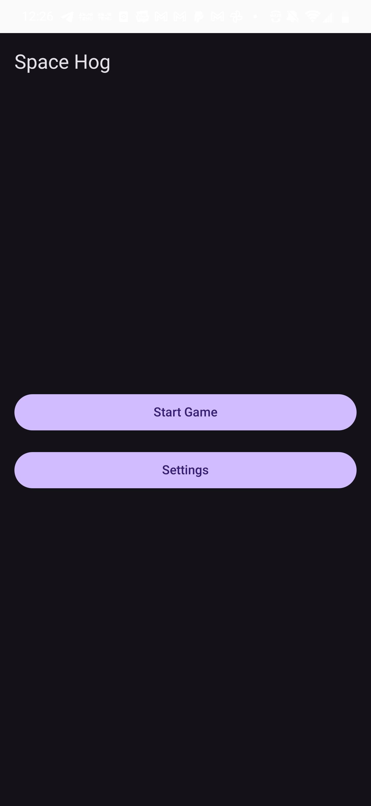
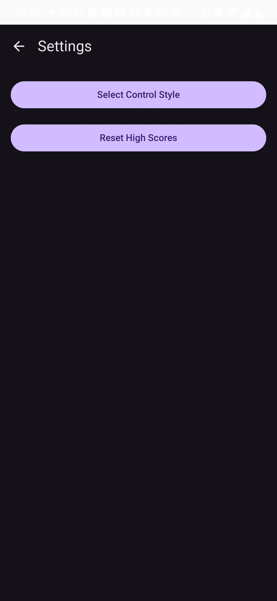
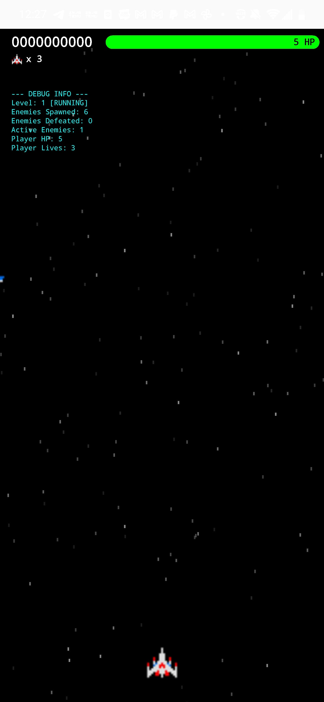
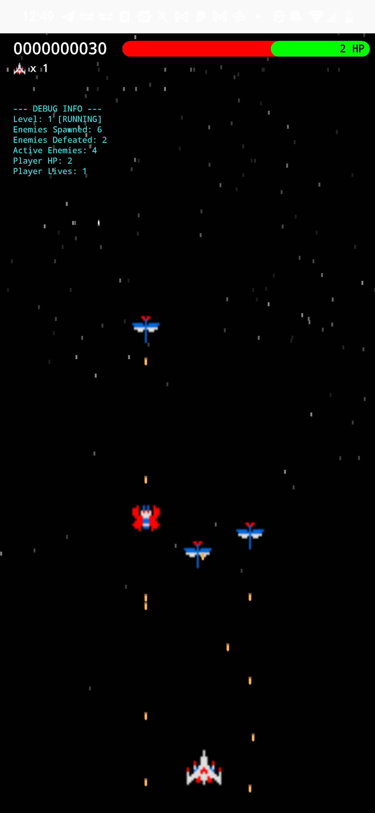
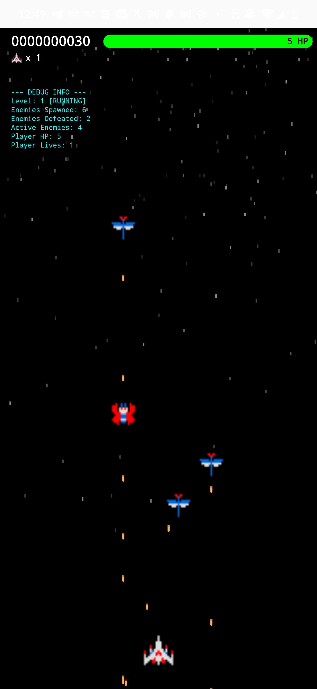
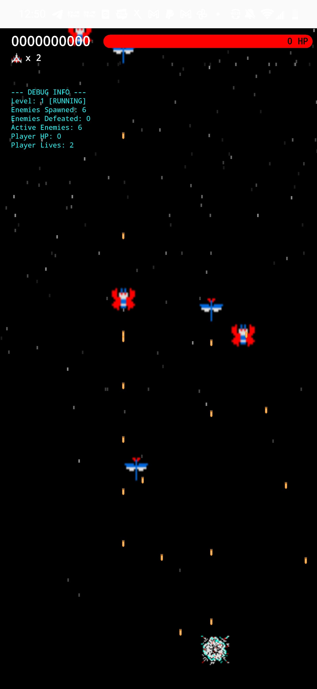
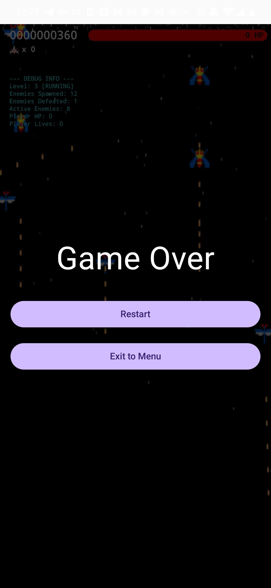
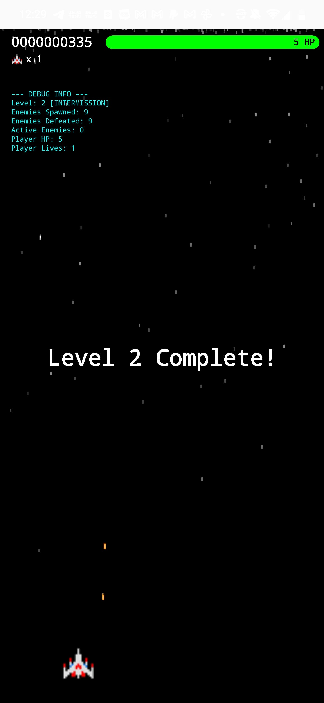

# Space Hog: A Modern 2D Arcade Shooter Engine

Space Hog is a classic top-down, vertically scrolling shoot 'em up game built from the ground up for modern Android devices. It is a re-engineering of an older Java-based project, completely recreated in Kotlin with a focus on modern architecture, high performance, and data-driven design principles.

This project serves as a robust foundation for creating rich, dynamic, and challenging arcade shooter experiences. The engine is designed to be highly extensible, allowing developers to easily add new enemies, weapons, levels, and gameplay mechanics.

## Features

*   **Classic Arcade Gameplay:** Fast-paced, top-down shooter action.
*   **Dynamic Levels:** Scripted enemy waves with varied attack patterns and speeds.
*   **Player Progression:** A health and lives system with a "Game Over" state.
*   **Power-up System:** A flexible system for collectible power-ups with timed effects.
*   **Advanced UI:** A custom-rendered HUD built for performance, featuring a dynamic scoreboard, health bar, and lives counter.
*   **High Performance:** Optimized for smooth, 60 FPS gameplay by leveraging modern Android game development patterns.

## Architecture and Design

The Space Hog engine is built on a clean, decoupled architecture that separates game logic from rendering and UI. This makes the codebase easy to understand, maintain, and expand.

The core architectural pattern is a **Director-World-HUD** model:

*   **The Director (`GameRenderer.kt`):** This is the high-level conductor. It runs the main game loop on a dedicated background thread, ensuring the UI remains smooth. Its only job is to tell the other components *when* to update their state and draw themselves.

*   **The Game World (`GameWorld.kt`):** This class is the "single source of truth" for the gameplay simulation. It contains and manages all interactive game objects: the player ship, enemies, bullets, and power-ups. It is also responsible for mediating interactions between these objects, such as collision detection.

*   **The HUD (`HUD.kt`):** This class is solely responsible for rendering the user interface layer (score, health, lives, messages). It reads state from the `GameWorld` but does not contain any game logic itself.

*   **UI and Hosting (`GameScreen.kt`):** The game is hosted within a **Jetpack Compose** `@Composable`. The classic Android `SurfaceView` (for high-performance game rendering) is embedded using the `AndroidView` interoperability API. All player input (touch, gestures) is captured by Compose modifiers and passed down to the `GameWorld` for processing.

## Key Techniques and Patterns

This project leverages several modern game development patterns to achieve its flexibility and performance.

### Sprite & Animation System
*   All visual objects (`PlayerShip`, `Enemy`, `Bullet`, `Effect`) inherit from a powerful base **`Sprite.kt`** class.
*   The system supports both static images and **sprite sheet animations**. An animation is defined simply by providing a horizontal strip of frames in a single bitmap and specifying the `frameCount`.
*   Animation playback is **thread-safe** and mathematically robust, using a modulo operator in the `draw` call to prevent `IndexOutOfBounds` exceptions, a common issue in multi-threaded renderers.

### Data-Driven Level and Entity Design
This is the core philosophy of the engine. Instead of creating rigid classes for each specific entity, the behavior and properties of objects are defined by simple, readable **data classes and enums**.

*   **Level Design:** Levels are defined in a central `LevelData.kt` file. A level is simply a list of `SpawnEvent` objects, each specifying *what* enemy to spawn, *when*, *where*, and with what *behavior* (movement pattern, fire rate, speed). Creating new levels or tweaking existing ones requires no logic changes.
*   **Enemy Variety:** There is only one generic **`Enemy.kt`** class. Its specific characteristics (HP, score, bitmap, animation frames) are determined by an **`EnemyType` enum** passed to it upon creation.
*   **Customizable Weapons & Power-ups:** The player's abilities are managed via the **Strategy Design Pattern**. The `PlayerShip` has a `WeaponSystem` property that can be swapped out at runtime. New weapons (like `MissileLauncher` or `LaserBeam`) can be added by creating a new class that implements the `WeaponSystem` interface, with no changes needed to the `PlayerShip` itself. Power-ups are defined as data in a `PowerUpType` enum.

### Memory Management and Performance
High performance (a consistent 60 FPS) is a primary goal. This is achieved through a singular, critical technique: **avoiding garbage collection in the main game loop.**

*   **Object Pooling:** All frequently created and destroyed objects (bullets, enemies, explosion effects) are managed by high-performance **object pools** (`BulletBank`, `EnemyManager`, `EffectManager`).
*   **Pre-allocation:** A large number of objects are created and allocated in memory *once* during a loading phase (`setupGame()`).
*   **Recycling:** Instead of creating a `new Bullet()` on every shot, the system finds an inactive bullet in the pool and "respawns" it at the new position. This reduces memory churn to near-zero during gameplay, eliminating the stutters and pauses associated with garbage collection.
*   **Asset Management:** All `Bitmap` assets are pre-loaded into a central **`AssetLibrary.kt`** at startup. Game objects are given direct references to these bitmaps, avoiding any file I/O or decoding during gameplay.

## Screenshots

*(Here you can add your screenshots by replacing the placeholder paths)*

| | | |
| :---: | :---: | :---: |
|  |  |  |
| *Splash Screen* | *Main Menu* | *Settings* |
|  |  |  |
| *Level Start* | *Mid-Level Action* | *Intense Firefight* |
|  |  |  |
| *Player Explosion* | *Game Over* | *Level Complete* |

To add screenshots:
1.  Create a folder named `screenshots` in the root directory of your project.
2.  Add your image files (`screen1.png`, `screen2.png`, etc.) to this folder.
3.  Commit and push the folder to your repository.

## Build Requirements

To build and run this project, you will need the following environment configuration:

*   **Java:** `OpenJDK 24` or compatible.
*   **Android SDK:** `API 36` (Android VanillaIceCream) or higher.
*   **NDK:** `29.0.14033849` or higher (required for stripping native libraries).
*   **Gradle:** `9.0.0` or higher.
*   **Android Gradle Plugin (AGP):** `8.13.0` or higher.
*   **Kotlin:** `2.2.20` or higher.